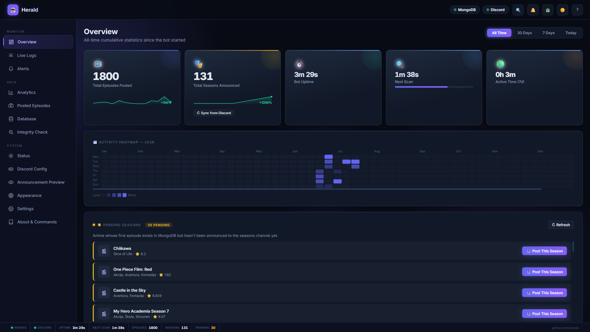
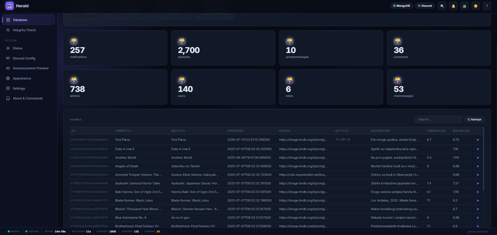
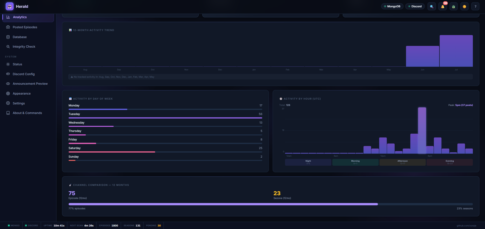
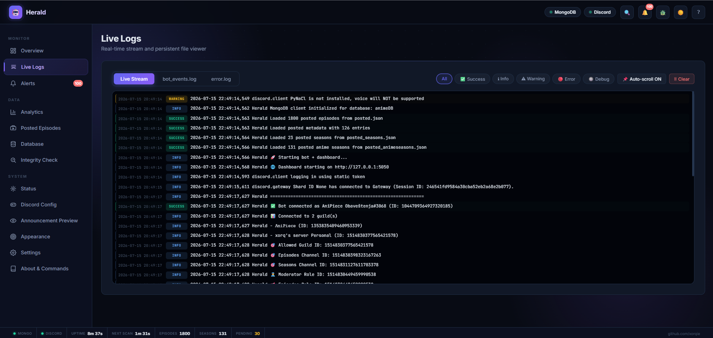
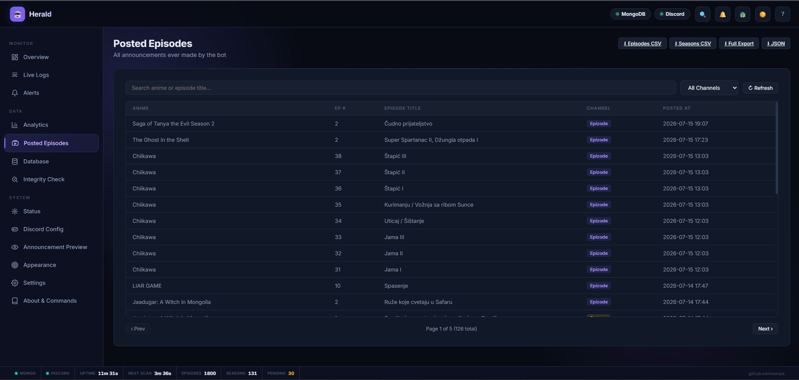
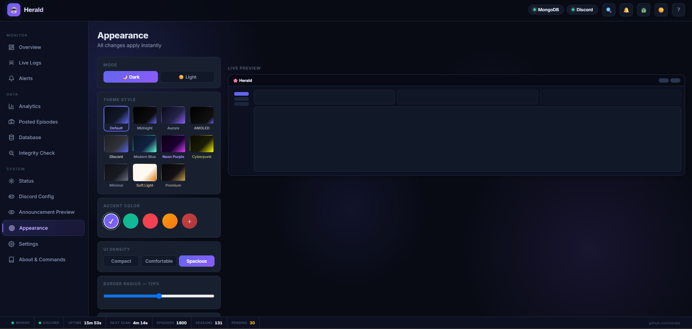

# 🌸 Herald — Real-Time Discord Dashboard & MongoDB Automation Platform

**Herald** is a self-hosted platform that connects MongoDB with Discord, automatically monitoring database activity and publishing structured updates to Discord channels while providing a real-time web dashboard for monitoring, analytics, and system management.

Designed as a configurable automation platform rather than a single-purpose bot, Herald demonstrates database integration, real-time event processing, dashboard development, and data monitoring using modern web technologies.

> Built by [xorqie](https://github.com/xorqie)

## Dashboard Preview

### Main Dashboard



### Database Overview



### Analytics Dashboard




### Live Logs & Monitoring



### Discord Announcement Integration



### Application Appearance & Configuration



---

## What is Herald?

Most Dashboards and Discord/MongoDB automations are bridged and built around a single use case. Herald is different — it is a **flexible automation framework** that connects any MongoDB database to Discord automatically monitoring database activity and publishing structured updates to Discord channels while providing a real-time web dashboard for monitoring, analytics, and system management.

**Some of the things you can use Herald for:**

- Announcing new blog posts or articles published to your website's database
- Notifying your community when new products, drops, or listings go live
- Posting game update with data or patch notes available/stored in MongoDB
- Alerting a support channel when new tickets or reports are submitted 
- Broadcasting database-driven news, events, or releases to your Discord server
- Any scenario where you want Discord to react automatically when your MongoDB data changes

The dashboard gives you real-time visibility into everything: live logs, analytics, data exports, integrity checks, and full configuration control — all from a browser, without touching the server. This architecture additionally allows the same platform to support a wide range of database-driven automation workflows without modifying the core application.

---

## ✨ Platform Features

### Core Automation
- **Real-time DB monitoring** — polls any MongoDB collection on a configurable interval and announces new entries automatically
- **Smart batching** — groups related entries into clean digest posts rather than flooding the channel, based on configurable thresholds and time windows
- **Deduplication** — tracks every announced entry locally so nothing is posted twice, even across restarts
- **Date filtering** — only announce entries created after a configurable start date

### Real-Time Dashboard
- **Live WebSocket stream** — status, logs, and events update in real time without refreshing
- **Activity heatmap** — full-year grid showing announcement/changes in the database volume by day
- **12-month analytics** — trend charts, peak day/hour analysis, channel comparison
- **Notification center** — Discord-style dropdown showing recent announcement history
- **Integrity checker** — detects mismatches between tracking files and auto-fixes them
- **Weekly digest** — optional Sunday summary embed with week-over-week comparison

### Discord Integration
- **Live channel/role dropdowns** — Discord Config page fetches your real server's channels and roles; no manual ID entry
- **Slash commands** — `/stats` and `/pending_items` available to moderators on mobile
- **Test announcements** — send labelled test embeds to verify your config before going live
- **Reaction emoji** — configurable per-announcement reactions
- **Moderator permission system** — role-gated commands, configurable per server

### Data & Export
- **Read-only MongoDB explorer** — browse any collection directly from the dashboard
- **CSV and JSON export** — download all tracked announcement data instantly
- **Audit log** — full history of configuration changes

### Appearance
- **11 theme styles** — Default, Midnight, Aurora, AMOLED, Discord, Modern Blue, Neon Purple, Cyberpunk, Minimal, Soft Light, Premium
- **Dark and light variants** for every theme
- **Custom accent colour picker** with shareable preset codes
- **UI density, border radius, blur, font family** — all adjustable live

---

## 🚀 Quick Start

### Requirements

- Python 3.10 or higher
- A Discord bot token 
- A MongoDB database

### Option 1 — One-click launcher (recommended)

**Windows:**
```
Double-click run.bat
```

**Linux / macOS:**
```bash
chmod +x run.sh
./run.sh
```

The launcher installs dependencies automatically and runs the setup wizard on first launch.

### Option 2 — Manual

```bash
# Clone
git clone
cd herald

# Install dependencies
pip install -r requirements.txt

# First-time setup wizard
python setup.py

# Start
python discordbot.py
```

The dashboard opens Locally hosted, automatically at `http://127.0.0.1:5050`.

---

## ⚙️ Configuration

Run the interactive wizard for a guided walkthrough:
```bash
python setup.py
```

Or copy the example config and edit it directly:
```bash
cp config.example.json config.json
```

### Required keys

| Key | Description |
|-----|-------------|
| `TOKEN` | Discord bot token |
| `MONGO_URI` | MongoDB connection string (`mongodb+srv://...`) |
| `GUILD_ID` | Your Discord server ID |
| `PRIMARY_CHANNEL_ID` | Main channel for announcements |
| `SECONDARY_CHANNEL_ID` | Secondary channel (featured items, digests, etc.) |
| `MODERATOR_ROLE_ID` | Role permitted to use bot commands |

### Optional keys

| Key | Default | Description |
|-----|---------|-------------|
| `COLLECTION_NAME` | `entries` | Primary MongoDB collection to monitor |
| `SECONDARY_COLLECTION` | `catalogue` | Secondary collection (series, categories, etc.) |
| `MONGO_DB` | `heralddb` | Database name |
| `CHECK_INTERVAL` | `300` | Scan interval in seconds |
| `BATCH_THRESHOLD` | `8` | Entries before triggering a batch digest post |
| `MINI_BATCH_THRESHOLD` | `3` | Entries before triggering a mini batch |
| `BATCH_HOURS` | `24` | Time window for batching related entries |
| `START_DATE` | — | Ignore entries created before this ISO date |
| `REACTION_EMOJI` | `🎉` | Emoji reacted to each announcement |
| `WEEKLY_DIGEST_ENABLED` | `false` | Post a weekly summary every Sunday at 18:00 |
| `DIGEST_CHANNEL_ID` | `null` | Channel for weekly digest (defaults to primary channel) |
| `DASHBOARD_PORT` | `5050` | Web dashboard port |

---

## 🗂️ Project Structure

```
herald/
├── discordbot.py          # Bot core — monitoring loop, announcements, commands
├── dashboard_server.py    # FastAPI backend — REST API, WebSocket, analytics
├── setup.py               # Interactive first-run configuration wizard
├── run.bat                # Windows one-click launcher
├── run.sh                 # Linux/macOS one-click launcher
├── config.example.json    # Configuration template (safe to commit)
├── config.json            # Your config — gitignored, never commit this
├── requirements.txt       # Python dependencies
└── templates/
    └── index.html         # Dashboard frontend (single self-contained file)
```

**Runtime files** (auto-created on first run, all gitignored):
```
posted.json                # IDs of entries that have been announced
posted_metadata.json       # Metadata for each announced entry
posted_seasons.json        # Secondary/featured announcement records (internal filename)
posted_animeseasons.json   # Discord message IDs for secondary announcements (internal filename)
dashboard_alerts.json      # Notification center history
weekly_digest.json         # Weekly digest send-tracking
```

---

## 🤖 Discord Commands

All commands require the configured Moderator role or Administrator permission.

### Slash Commands

| Command | Description |
|---------|-------------|
| `/stats` | Platform statistics — post counts, uptime, channels, intervals |
| `/pending_items` | List entries in the database not yet announced |

### Prefix Commands (`!`)

| Command | Description |
|---------|-------------|
| `!force_check` | Trigger an immediate database scan |
| `!stats` | Show platform statistics |
| `!test_announcement` | Send a test announcement using a recent database entry |
| `!test_featured` | Send a test featured/secondary announcement |
| `!sync_metadata [limit]` | Sync entry metadata from Discord message history |
| `!build_metadata [limit]` | Rebuild metadata by cross-referencing MongoDB and Discord |
| `!check_files` | Check local tracking file health |
| `!fix_json` | Auto-repair corrupted tracking files |
| `!clear_cache` | Clear the in-memory data cache |
| `!logs [lines]` | Post recent log output to Discord |
| `!view_posted [limit]` | Show recently announced entries |
| `!reset_posted` | ⚠️ Clear all announcement history (requires confirmation) |

---

## 📊 Dashboard Pages

| Page | Description |
|------|-------------|
| **Overview** | Live stats, activity heatmap, recent feed, pending items panel |
| **Analytics** | 12-month trends, peak day/hour charts, channel comparison |
| **Live Logs** | Real-time colour-coded log stream with level filtering |
| **Alerts** | Notification center — announcement history in a dropdown panel |
| **Posted Items** | Paginated announcement history with search and CSV export |
| **Database** | Read-only MongoDB collection explorer with export |
| **Integrity Check** | Mismatch detection between tracking files, with auto-fix |
| **Status** | System health — MongoDB, Discord, uptime, error count |
| **Discord Config** | Live channel/role selectors, emoji picker, test announcement panel |
| **Appearance** | Full theme customisation — styles, dark/light, accent, density, font |
| **Settings** | Notification preferences |
| **About & Commands** | Architecture overview and full command reference |

---

## 📦 Export Formats

Available from the **Database** page and the **Posted Items** header:

| File | Contents |
|------|----------|
| `entries.csv` | All announced entries with metadata |
| `featured.csv` | All secondary/featured announcements |
| `all.csv` | Combined export with a `type` column |
| `metadata.json` | Raw metadata — suitable for migration or backup |

---

## 🗄️ MongoDB Integration

Herald can connect to **one or more MongoDB databases** and monitor **any number of collections**. You configure which databases and collections to watch, and the bot fetches, processes, and announces new entries automatically — without any code changes.

**How it works:**

1. Herald polls the configured collection(s) on a set interval
2. Each new document is compared against the local deduplication store
3. New entries are formatted as Discord embeds and posted to the configured channel(s)
4. The entry ID is recorded locally to prevent re-announcement

**There are no required field names.** Herald is designed to work with whatever schema your data already uses. You configure which fields map to which parts of the announcement embed (title, description, image, etc.) via `config.json`.

---

### Example schemas

These are illustrative examples only — your collections can have any structure.

**Content feed** (blog posts, articles, releases):
```json
{
  "_id": "ObjectId",
  "title": "string",
  "summary": "string",
  "category": "string",
  "publishedAt": "ISODate",
  "imageUrl": "url",
  "author": "string"
}
```

**Product / listing catalogue:**
```json
{
  "_id": "ObjectId",
  "name": "string",
  "description": "string",
  "price": 0.00,
  "category": "string",
  "thumbnailUrl": "url",
  "available": true
}
```

**Support tickets / submissions:**
```json
{
  "_id": "ObjectId",
  "subject": "string",
  "body": "string",
  "priority": "string",
  "submittedAt": "ISODate",
  "submittedBy": "string"
}
```

Your actual schema can be anything — these exist only to illustrate the range of use cases.

---

## 🛠️ Self-Hosting

**Run 24/7 with pm2:**
```bash
npm install -g pm2
pm2 start discordbot.py --interpreter python3 --name herald
pm2 save && pm2 startup
```

**Health endpoint** — useful for uptime monitors and auto-restart on failure:
```
GET http://localhost:5050/api/health
→ 200 OK                    bot running, MongoDB connected
→ 503 Service Unavailable   something is down
```

**Background process without pm2:**
```bash
nohup python discordbot.py > herald.log 2>&1 &
```

---

## 🔒 Security

- The dashboard binds to `127.0.0.1` by default — not exposed to the internet
- Slash command responses are ephemeral — only the caller sees them
- No external API calls — all data stays on your infrastructure
- Integrity fix endpoint is only accessible while the bot process is running

---

## 📄 License

MIT — see [LICENSE](LICENSE) for details.

---

*Built by [xorqie](https://github.com/xorqie)*
